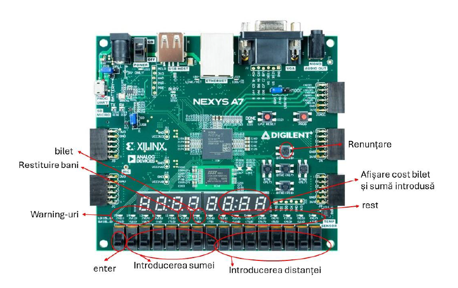

# 🚂 VHDL Train Ticket Automat
**Digital System Design Project** | *Technical University of Cluj-Napoca*

---

## 📖 Project Overview

This project implements a modular **VHDL-based automated ticket machine** for train travel. Designed to run on the **Xilinx Nexys A7** FPGA, the system manages the complete transaction process: from distance-based price calculation to payment processing, change distribution, and error signaling.

### **Key Features**
* **Distance-Based Pricing**: Users input the travel distance in tens of kilometers; the system calculates the cost at a rate of 1€ per 10km.
* **Real-Time Display**: Ticket costs and entered sums are displayed on the 7-segment displays.
* **Currency Support**: The system operates in Euro, supporting maximum ticket prices of up to 100€.
* **Transaction Safety**: Features a "Renunțare" (Cancel) button available at any point to refund the current session.
* **Error Handling**: Visual LED warnings for insufficient funds, out-of-stock tickets, or the inability to provide exact change.

---

## 🛠️ Hardware Specifications
The project is optimized for the **Digilent Nexys A7 (Artix-7 family)** development board.

* **Inputs**:
    * **Switches**: Used for binary input of distance and sum.
    * **Buttons**: Used for reset.
* **Outputs**:
    * **7-Segment Displays**: Shows numeric data (price, sum).
    * **LEDs**: Indicate "Bilet" (ticket issued) and various system warnings.

---

## 🏗️ System Architecture
The system follows a structural VHDL design, decomposed into two primary units: the **Control Unit (UC)** and the **Execution Unit (UE)**.

### **Core Components**
1.  **Finite State Machine (FSM)**:
    * Manages the project's logic through defined states: Start, Distance Input, Price Display, Sum Input, and Verification.
2.  **Binary-to-BCD Converter**:
    * Converts 8-bit binary numbers to 12-bit Binary Coded Decimal (BCD) using the **Double Dabble algorithm** for 7-segment compatibility.
3.  **Display Driver**:
    * Includes a **Frequency Divider** (using a 17-bit counter) to multiplex the 8-digit display at a human-readable refresh rate.
    * Uses **MUX 8:1** and **MUX ANOD** to select the active digit and its corresponding value.
4.  **Signal Conditioning (MPG)**:
    * Implements a debouncer for the "Renunțare" button to ensure clean signal transitions from mechanical inputs.

---

## 📖 Documentation
Detailed technical specifications, block diagrams, and state machine organigrams can be found in the full project documentation:

👉 **[View Full Documentation (PDF)](documentatie_fin.pdf)**
